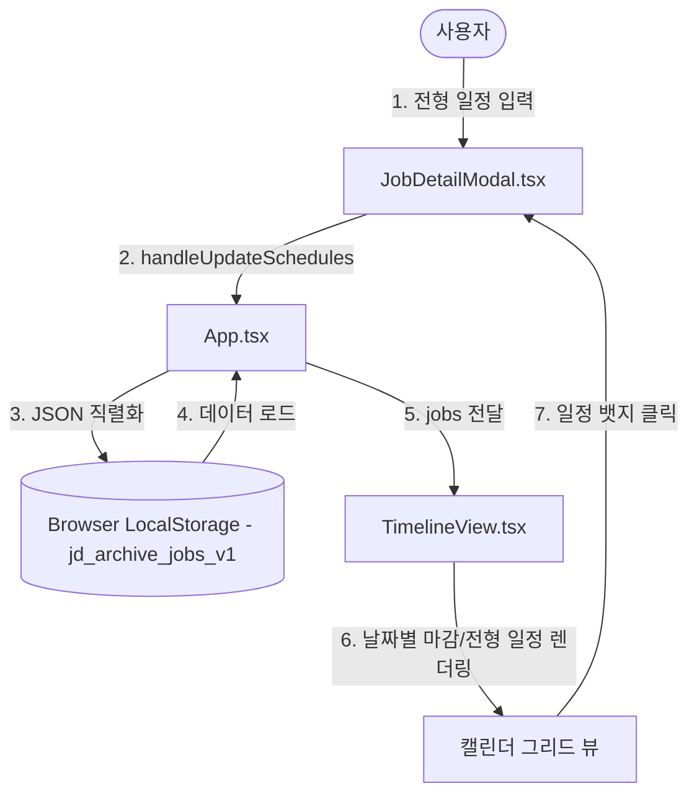

# [PRD] 커리어핏 (CareerFit) - 로컬 단독형(Pure SPA) 아키텍처 및 전형 일정 스케줄러 고도화 (v2)

## 1. 프로젝트 개요 (Project Overview)
- **제품명**: 커리어핏 (CareerFit)
- **서비스 목적**: 사용자가 채용 공고(JD)를 스크랩하거나 직접 텍스트를 입력하면, AI가 주요 업무·필수 자격요건·선호 요건을 구체적으로 구조화하고, 이를 구직자의 이력서와 비교 분석하여 매칭률, 강점, 보완점, 맞춤형 이력서 개선안을 브라우저 내에서 직접 제공하는 단독 실행형(Pure SPA) 채용 보조 서비스입니다.
- **v2 핵심 추가 요구사항 (2026-08-07)**:
  - 구직 과정의 마일스톤 관리를 캘린더에서 직관적으로 파악할 수 있도록, 기존 공고마감일 자동 연동 외에 사용자가 직접 공고별로 **서류 접수일, 1차 면접, 과제 제출, 2차 면접, 최종 면접 등 세부 전형 진행 일자**를 등록/편집하는 '전형 일정 커스텀 관리 기능'을 도입합니다.
  - 추가된 커스텀 일정들을 월별 캘린더 뷰에 전용 스타일(뱃지 형태)로 마감 일정과 구분하여 렌더링하고, 클릭 시 상세 제어 모달로 부드럽게 전환하는 UX 시나리오를 완성합니다.

---

## 2. 비즈니스 배경 및 목표 (Business Background & Goals)
- **전형별 맞춤형 스케줄링**: 서류 접수 이후 각 기업마다 전형 일정(인적성, 코테, 1차 면접 등)이 다양하게 분화되어 발생하므로, 마감일만 표시되던 캘린더를 실무적인 전형 일정 캘린더 스케줄러로 진화시킵니다.
- **UX의 통합성 및 즉시성**: 캘린더 뷰에서 일정을 파악하고, 해당 공고 일정(뱃지)을 클릭하는 것만으로 상세 정보 및 매칭 진단 모달로 원클릭 전환되게 하여 사용자 사용성을 크게 향상합니다.
- **데이터 로컬 저장 보안성**: 새로 추가되는 커스텀 일정 데이터 역시 서버에 저장되지 않고, 오직 사용자의 브라우저 로컬 저장소(`localStorage`)에만 저장되므로 개인 보안과 프라이버시가 완벽히 존중됩니다.

---

## 3. 핵심 요구사항 및 기능 명세 (Key Requirements & Specification)

### 3.1. 사용자 직접 API Key 관리 및 로컬 저장
- **GNB Key 등록 인터페이스**: 네비게이션 바 영역에 [Gemini Key 등록] 버튼을 추가하여 사용자가 API Key를 입력/수정/삭제할 수 있는 UI를 제공합니다.
- **로컬 보안 저장**: 입력받은 API Key는 오직 브라우저의 `localStorage` (`careerfit_gemini_api_key`)에만 안전하게 로컬 임시 보관합니다.
- **Fallback 시뮬레이션**: API Key가 없는 상태에서도 예시 카드 분석 제공 및 정규식 기반 키워드 파싱 모드로 기본 동작을 보장합니다.

### 3.2. 리스크 방지형 공고 스크랩 UX
- **공고 텍스트 직접 붙여넣기(Default)**: 복잡하고 불안정한 외부 플랫폼 크롤링 대신, 복사-붙여넣기를 유도하도록 '공고 텍스트 직접 붙여넣기' 탭을 기본으로 제공하며 권장 배너를 배치합니다.
- **개인정보 및 데이터 보안 고지**: 데이터가 외부 서버에 축적되지 않고 로컬 스토리지에만 저장됨을 하단에 명시합니다.

### 3.3. 2-Column 기반의 공고 상세 및 서류 매칭 인터페이스
- **좌측(JD 상세 영역)**: AI가 회사명, 포지션, 주요 업무, 자격 요건, 우대 사항으로 구조화하여 상세하게 파싱한 공고 내용과 원문 전체 정보를 보여줍니다.
- **우측(매칭 리포트 영역)**: 구직자의 첨부 서류와 대조한 AI 매칭 점수, 일치 역량, 부족한 역량, 포트폴리오/이력서 보완 가이드를 제공합니다.
- **첨부 서류 삭제 연동**: 첨부 서류 태그의 휴지통 아이콘을 누르면 서류가 제거되며, 남은 서류 기준으로 AI 분석 결과가 실시간 갱신됩니다.

### 3.4. 공고별 커스텀 전형 일정 관리 및 캘린더 연동 [NEW in v2]
- **전형 일정 추가/삭제 UI**: 공고 상세 모달 내 우측 하단에 '전형 진행 일정 관리' 섹션을 배치합니다.
  - 일정명(예: "1차 면접", "과제 마감")과 날짜 선택(Date Picker)을 제공하여 커스텀 일정을 동적으로 리스트에 추가합니다.
  - 리스트의 등록된 일정에는 개별 삭제(X) 아이콘이 있는 디자인 칩(Chip)을 제공합니다.
- **월간 캘린더 멀티 이벤트 렌더링**:
  - 기존 공고 마감일은 **🔴 마감: [회사명]** (연한 빨간색 배경) 스타일로 유지됩니다.
  - 사용자가 기입한 개별 전형 일정은 **📅 [일정명]: [회사명]** (연한 파란색 배경) 스타일 뱃지로 캘린더 각 칸에 나열됩니다.
- **캘린더-모달 원클릭 UX 단선화**: 캘린더 상의 마감 또는 전형 일정을 클릭하면, 즉시 해당 공고의 상세 모달이 열려 내용 수정이나 AI 분석 내용을 확인할 수 있습니다.

---

## 4. 기술 아키텍처 및 데이터 흐름 (Technical Architecture & Data Flow)

### 4.1. 시스템 아키텍처 개요

### 4.2. 주요 기술 스택
- **프론트엔드 프레임워크**: React 18, TypeScript, Vite (순수 SPA 빌드 및 실행)
- **스타일링**: Vanilla CSS, Lucide React (아이콘)
- **클라이언트 AI 모듈**: Google Gemini API (`gemini-2.5-flash` 모델 REST API 연동)
- **로컬 저장소**: 브라우저 내장 `localStorage` (`jd_archive_jobs_v1`, `jd_archive_resume_v1`, `careerfit_gemini_api_key`)

---

## 5. 변경 대상 주요 컴포넌트/파일 명세

1. **[src/types.ts](file:///c:/Users/amy%20hyewon%20lee/blog-new/content/01_Projects/20260804_커리어핏%20프로젝트/커리어핏-프로젝트/src/types.ts) [MODIFY]**
   - 커스텀 전형 일정을 표현할 `CustomSchedule` 타입을 새롭게 추가하고 `JobPost` 구조 내에 `customSchedules` 필드를 선택형 배열로 확장합니다.
2. **[src/App.tsx](file:///c:/Users/amy%20hyewon%20lee/blog-new/content/01_Projects/20260804_커리어핏%20프로젝트/커리어핏-프로젝트/src/App.tsx) [MODIFY]**
   - 커스텀 일정을 다루는 비동기식 상태 관리 핸들러(`handleUpdateSchedules`)를 추가하고 `localStorage`와의 동기화를 확실히 구성합니다.
3. **[src/components/JobDetailModal.tsx](file:///c:/Users/amy%20hyewon%20lee/blog-new/content/01_Projects/20260804_커리어핏%20프로젝트/커리어핏-프로젝트/src/components/JobDetailModal.tsx) [MODIFY]**
   - 전형 단계 입력 인풋 및 날짜 선택 폼을 구현하고, 등록된 커스텀 일정을 삭제 및 추가할 수 있는 인터랙션 요소를 구축합니다.
4. **[src/components/TimelineView.tsx](file:///c:/Users/amy%20hyewon%20lee/blog-new/content/01_Projects/20260804_커리어핏%20프로젝트/커리어핏-프로젝트/src/components/TimelineView.tsx) [MODIFY]**
   - 월별 캘린더 모드에서 공고 마감일과 커스텀 전형 일정을 취합하여 렌더링하고, 이모티콘(🔴, 📅)과 시각적으로 대비되는 배경 스타일링을 적용합니다. 
