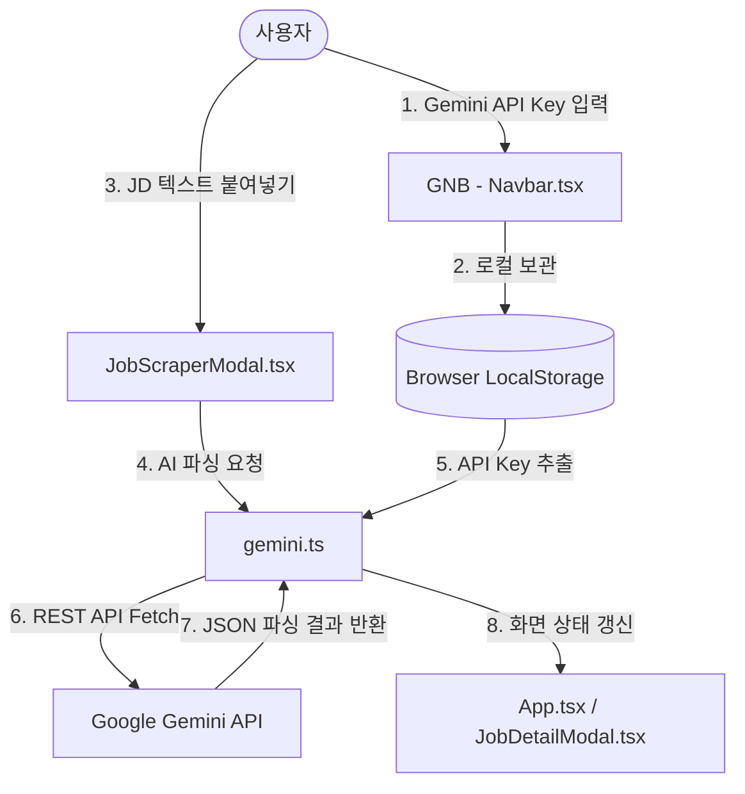

# [PRD] 커리어핏 (CareerFit) - 로컬 단독형(Pure SPA) 아키텍처 및 리스크 대응 고도화

## 1. 프로젝트 개요 (Project Overview)
- **제품명**: 커리어핏 (CareerFit)
- **서비스 목적**: 사용자가 채용 공고(JD)를 스크랩하거나 직접 텍스트를 입력하면, AI가 주요 업무·필수 자격요건·선호 요건을 구체적으로 구조화하고, 이를 구직자의 이력서와 비교 분석하여 매칭률, 강점, 보완점, 맞춤형 이력서 개선안을 브라우저 내에서 직접 제공하는 단독 실행형(Pure SPA) 채용 보조 서비스입니다.
- **최신 릴리즈 핵심 변경 사항 (2026-08-07)**:
  - 기존 백엔드 서버(Express API 서버) 및 Vercel 서버리스 연동을 완전 배제하고, 서버가 필요 없는 **브라우저 단독 실행형(Pure SPA)** 아키텍처로 전향.
  - 외부 채용 플랫폼(원티드, 링크드인 등)의 스크래핑 관련 법적·비즈니스적 리스크(IP 차단, 부정경쟁방지법 저촉 소지 등)를 원천 차단하기 위해 **텍스트 복사-붙여넣기(Copy & Paste) UX 중심** 설계 점검 및 적용.
  - 사용자가 본인의 **Google Gemini API Key**를 직접 브라우저에 등록하여 클라이언트에서 직접 Gemini API를 호출하도록 설계함으로써 완벽한 개인화 및 프라이버시 보호 실현.

---

## 2. 비즈니스 배경 및 목표 (Business Background & Goals)
- **법적/정책적 안정성**: 플랫폼사의 데이터 무단 크롤링 분쟁을 차단하기 위해, 사용자의 개인 도구(메모장) 개념으로 접근하여 텍스트 직접 입력 방식을 권장하고 법적 리스크를 해소합니다.
- **데이터 보안 및 프라이버시**: 민감한 구직 정보와 이력서가 외부 백엔드 서버로 전송되어 수집되거나 노출되는 우려를 제로(0)화합니다.
- **서버 비용 제로화**: 백엔드 인프라 유지 비용 및 AI API 호출 예산을 중앙화하지 않고, 사용자 개인 API Key를 활용함으로써 서비스 운영비용을 발생시키지 않습니다.
- **UX의 지속성 (Fallback)**: 사용자가 API Key를 입력하지 않은 상태이거나 네트워크 장애가 발생하더라도, 로컬에 저장된 예시 데이터 및 정규식 기반 대체 연동 로직을 구동하여 서비스 사용 경험을 계속 제공합니다.

---

## 3. 핵심 요구사항 및 기능 명세 (Key Requirements & Specification)

### 3.1. 사용자 직접 API Key 관리 및 로컬 저장
- **GNB Key 등록 인터페이스**: 네비게이션 바 영역에 [Gemini Key 등록] (열쇠 아이콘) 버튼을 추가하여 사용자가 언제든 API Key를 입력/수정/삭제할 수 있는 UI를 제공합니다.
- **로컬 보안 저장**: 입력받은 API Key는 외부 서버로 송신하지 않으며, 오직 브라우저의 `localStorage` (`careerfit_gemini_api_key`)에만 안전하게 로컬 임시 보관합니다.
- **Fallback 시뮬레이션**: API Key가 없거나 만료된 상태에서도 사용자가 서비스를 충분히 파악할 수 있도록, 예시 카드 분석 결과 제공 및 정규식 기반 키워드 파싱 모드로 작동하게 보완합니다.

### 3.2. 리스크 방지형 공고 스크랩 UX
- **공고 텍스트 직접 붙여넣기(Default)**: 스크랩 모달 내에서 복잡하고 불안정한 외부 플랫폼 크롤링 대신, 복사-붙여넣기를 유도하도록 '공고 텍스트 직접 붙여넣기' 탭을 기본(Default State)으로 배치하고 권장 안내 배너를 상단에 노출합니다.
- **개인정보 및 데이터 보안 고지**: 스크랩 모달 하단에 데이터가 외부 서버에 영구 축적되지 않고 사용자의 로컬 스토리지에만 저장됨을 투명하게 고지합니다.
  - *"입력하신 채용 공고와 분석에 사용된 이력서 데이터는 서버에 저장되지 않으며, 오직 사용자의 브라우저(로컬 스토리지)에만 임시 보관됩니다."*

### 3.3. 2-Column 기반의 공고 상세 및 서류 매칭 인터페이스
- **좌측(JD 상세 영역)**: AI가 회사명, 포지션, 주요 업무, 자격 요건, 우대 사항으로 구조화하여 상세하게 파싱한 공고 내용과 원문 전체 정보를 명확히 보여줍니다.
- **우측(매칭 리포트 영역)**: 구직자의 첨부 서류와 대조한 AI 매칭 점수, 일치하는 역량, 부족한 자격 요건, 포트폴리오/이력서 보완 가이드를 리포트 형식으로 출력합니다.
- **첨부 서류 삭제 연동**: 첨부 서류 태그 옆의 휴지통 아이콘을 누르면 서류가 제거되며, 남은 서류 기준으로 로컬 AI 분석이 실시간으로 갱신됩니다.

---

## 4. 기술 아키텍처 및 데이터 흐름 (Technical Architecture & Data Flow)

### 4.1. 시스템 아키텍처 개요

### 4.2. 주요 기술 스택
- **프론트엔드 프레임워크**: React 18, TypeScript, Vite (순수 SPA 빌드 및 실행)
- **스타일링**: Tailwind CSS, Lucide React (아이콘)
- **클라이언트 AI 모듈**: Google Gemini API (`gemini-2.5-flash` 모델 REST API 연동)
- **로컬 저장소**: 브라우저 내장 `localStorage` (`careerfit_jobs`, `careerfit_resumes`, `careerfit_gemini_api_key`)

---

## 5. 변경 대상 주요 컴포넌트/파일 명세

1. **[package.json](file:///c:/Users/amy%20hyewon%20lee/blog-new/content/01_Projects/20260804_커리어핏%20프로젝트/커리어핏-프로젝트/package.json)**
   - 백엔드 Express 서버 빌드 및 동시 실행(concurrently) 스크립트를 제거하고, Vite 로컬 구동(`npm run dev`) 및 프로덕션 번들링(`npm run build`) 구조로 단순화.
2. **[src/utils/gemini.ts](file:///c:/Users/amy%20hyewon%20lee/blog-new/content/01_Projects/20260804_커리어핏%20프로젝트/커리어핏-프로젝트/src/utils/gemini.ts) [NEW]**
   - 브라우저 클라이언트 환경에서 `fetch`로 직접 Gemini 2.5 API를 호출하는 비동기 통신 로직 구현.
   - API Key 유무 판별 및 API 장애 시 작동할 정규식 기반 및 로컬 더미 데이터 Fallback 설계.
3. **[src/components/Navbar.tsx](file:///c:/Users/amy%20hyewon%20lee/blog-new/content/01_Projects/20260804_커리어핏%20프로젝트/커리어핏-프로젝트/src/components/Navbar.tsx)**
   - API Key 등록을 위한 토글형 미니 드롭다운 UI 추가.
   - 키 상태의 실시간 갱신 및 UI 내 시각적 피드백 제공 (키 등록 완료 시 배지 노출).
4. **[src/components/JobScraperModal.tsx](file:///c:/Users/amy%20hyewon%20lee/blog-new/content/01_Projects/20260804_커리어핏%20프로젝트/커리어핏-프로젝트/src/components/JobScraperModal.tsx)**
   - 백엔드 연동(`/api/scrape-jd`)을 신규 `localScrapeJD`로 전환.
   - 데이터 보안 고지 및 텍스트 붙여넣기 권장 안내 배너 상시 배치.
5. **[src/App.tsx](file:///c:/Users/amy%20hyewon%20lee/blog-new/content/01_Projects/20260804_커리어핏%20프로젝트/커리어핏-프로젝트/src/App.tsx)**
   - 백엔드 연동(`/api/analyze-match`)을 신규 `localAnalyzeMatch`로 전면 교체하여 서버리스 이관 완료.
