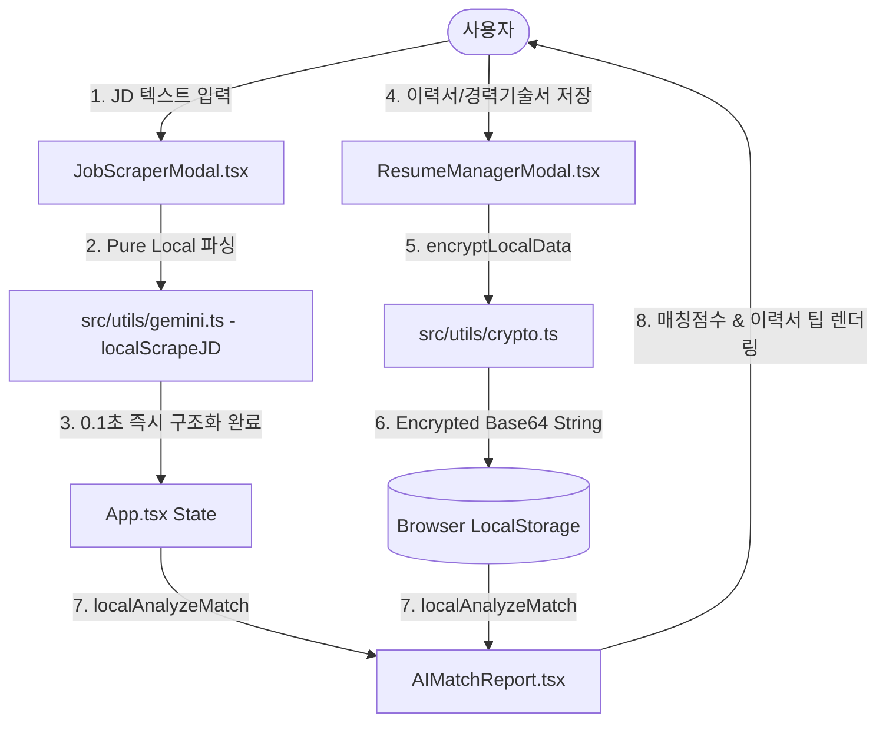

# [PRD] 커리어핏 (CareerFit) - 100% Pure Local 오프라인 아키텍처 및 이력서 로컬 암호화 보안 고도화 (v3)

## 1. 프로젝트 개요 (Project Overview)
- **제품명**: 커리어핏 (CareerFit)
- **서비스 목적**: 사용자가 채용 공고(JD)를 스크랩하거나 직접 텍스트를 입력하면, 외부 API Key 통신 없이 사용자 브라우저(내 컴퓨터)의 Pure Local 엔진이 주요 업무·필수 자격요건·선호 요건을 0.1초 만에 스마트하게 구조화하고, 구직자의 첨부 이력서/경력기술서와 비교 분석하여 매칭률, 강점, 보완점, 맞춤형 이력서 개선안을 완벽히 오프라인 환경에서 제공하는 단독 실행형(Pure SPA) 채용 보조 서비스입니다.
- **v3 핵심 추가 및 보완 요구사항 (2026-08-07)**:
  - **API Key 완전 제거**: 사용자가 외부 Gemini API Key를 발급받고 입력하는 번거로움과 복잡성을 완전히 철폐하고, 네비게이션 바(GNB)의 API Key 등록 모달 UI를 제거하여 "100% 로컬 보안 오프라인 파싱" 뱃지로 단순화합니다.
  - **Pure Local 스마트 파싱 및 매칭 엔진 고도화**: 다국어(한/영) 문맥 파서, 50여 가지 대표 기술 스택 및 역량 키워드 추출기, 수치화된 이력서 부합도 및 보완 팁 생성 엔진을 로컬 자바스크립트/타입스크립트로 전면 구동합니다.
  - **이력서 데이터 브라우저 로컬 암호화(Encrypted Storage)**: 사용자가 등록한 이력서 프로필 및 드래그 첨부 서류(경력기술서 원문 텍스트 등) 데이터가 `localStorage`에 저장될 때 XOR + Base64 보안 암호화(`encryptLocalData`, `decryptLocalData`)를 적용하여 타인이 브라우저 개발자 도구로 스토리지 데이터를 훔쳐볼 수 없도록 이중 프라이버시 보호 장치를 구축합니다.

---

## 2. 비즈니스 배경 및 목표 (Business Background & Goals)
- **완벽한 데이터 보안 및 무단 유출 방지**: 채용 공고 분석 및 개인 이력서/경력기술서 정보가 외부 LLM 서버로 송수신되지 않으므로 기업 비공개 정보 및 개인정보 유출 리스크가 0%입니다.
- **사용자 경험 극대화 (Zero API Key UX)**: API Key 발급 및 입력 오류, API 사용량 제한(Rate Limit), 네트워크 지연(Latency)이 사라져 파싱과 분석 버튼 클릭 즉시 (0.1초 이내) 분석 결과를 얻을 수 있습니다.
- **로컬 스토리지 이중 암호화**: 사용자의 로컬 환경 내에서도 이력서와 경력 텍스트가 평문(Plaintext)으로 보관되지 않고 암호화 처리되어 프라이버시가 안전하게 보호됩니다.

---

## 3. 핵심 요구사항 및 기능 명세 (Key Requirements & Specification)

### 3.1. Zero API Key & 100% Pure Local 파싱
- **GNB 보안 안내 뱃지**: 기존 API Key 입력 드롭다운 모달 버튼을 철폐하고, [100% 로컬 보안 파싱] 뱃지 UI로 대체합니다.
- **로컬 JD 파싱 엔진 (`localScrapeJD`)**:
  - `[회사명] 직무명` 대괄호 패턴, `-` 구분자 패턴, 첫 줄 제목 패턴으로 회사명과 직무명 자동 분리.
  - 주요 업무(Tasks), 필수 자격요건(Requirements), 우대 사항(Preferred), 혜택/전형절차 섹션 자동 정규식 감지.
  - React, TypeScript, Node.js, Python, Java, Go, Kubernetes, Electrophysiology, Product Management 등 50여 대표 키워드 자동 자음/알파벳 추출.
  - 마감일 (YYYY-MM-DD) 및 상시채용/채용시 마감 자동 판별.

### 3.2. 이력서 및 첨부 서류 로컬 암호화 저장소 (`src/utils/crypto.ts`)
- **암호화 알고리즘**: `encryptLocalData` 함수를 통해 이력서 JSON 직렬화 데이터를 시크릿 키 기반 XOR 변환 후 Base64 직렬화(`ENC_V1_...`) 처리하여 `localStorage` (`jd_archive_resume_v1`)에 안전 저장.
- **자동 복호화 로드**: 서비스 실행 시 `decryptLocalData`를 호출하여 이전 버전의 평문 데이터와 신규 암호화 데이터를 모두 감지하고 유연하게 복호화하여 메모리 상태로 로드.

### 3.3. Pure Local 이력서-공고 역량 매칭 리포트 (`localAnalyzeMatch`)
- **키워드 대조 및 점수 산정**: 공고의 요구 기술 키워드와 이력서/첨부서류 원문 간의 교집합 및 결여 키워드를 로컬 알고리즘으로 즉시 정밀 계산.
- **맞춤형 진단 3대 리포트**:
  - 일치하는 강점 항목 3가지 (`matchedPoints`)
  - 보완이 필요한 개선 항목 3가지 (`improvementPoints`)
  - 합격률 극대화를 위한 이력서 작성 팁 & 예상 면접 질문

---

## 4. 기술 아키텍처 및 데이터 흐름 (Technical Architecture & Data Flow)

---

## 5. 변경 대상 주요 컴포넌트/파일 명세

1. **[src/utils/gemini.ts](file:///c:/Users/amy%20hyewon%20lee/blog-new/content/01_Projects/20260804_커리어핏%20프로젝트/커리어핏-프로젝트/src/utils/gemini.ts) [MODIFY]**
   - Google Gemini API REST fetch 통신 코드 완전 제거.
   - `localScrapeJD` 및 `localAnalyzeMatch`를 100% Pure Local 오프라인 정밀 파싱/매칭 엔진으로 변경.
2. **[src/utils/crypto.ts](file:///c:/Users/amy%20hyewon%20lee/blog-new/content/01_Projects/20260804_커리어핏%20프로젝트/커리어핏-프로젝트/src/utils/crypto.ts) [NEW]**
   - LocalStorage 보안을 위한 이력서 및 첨부 서류 암호화/복호화 모듈 구현.
3. **[src/components/Navbar.tsx](file:///c:/Users/amy%20hyewon%20lee/blog-new/content/01_Projects/20260804_커리어핏%20프로젝트/커리어핏-프로젝트/src/components/Navbar.tsx) [MODIFY]**
   - API Key 입력 모달 UI 제거 및 `100% 로컬 보안 파싱` 뱃지로 교체.
4. **[src/components/JobScraperModal.tsx](file:///c:/Users/amy%20hyewon%20lee/blog-new/content/01_Projects/20260804_커리어핏%20프로젝트/커리어핏-프로젝트/src/components/JobScraperModal.tsx) [MODIFY]**
   - 파싱 실행 시 API Key 존재 여부 확인 confirm 팝업 제거.
5. **[src/App.tsx](file:///c:/Users/amy%20hyewon%20lee/blog-new/content/01_Projects/20260804_커리어핏%20프로젝트/커리어핏-프로젝트/src/App.tsx) [MODIFY]**
   - 이력서 저장 시 `encryptLocalData` 적용 및 로드 시 `decryptLocalData` 복호화 적용.
   - 매칭 분석 실행 시 API Key confirm 팝업 제거.
