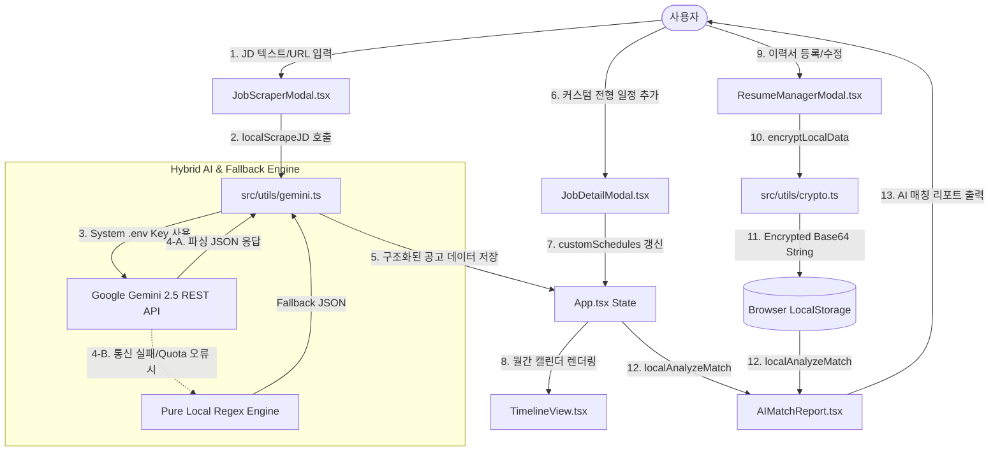

# [PRD] 커리어핏 (CareerFit) - Gemini 2.5 AI REST API 하이브리드 연동, 커스텀 전형 일정 타임라인 및 로컬 데이터 보안 암호화 (v4)

## 1. 프로젝트 개요 (Project Overview)
- **제품명**: 커리어핏 (CareerFit)
- **서비스 목적**: 구직자가 채용 공고(JD)를 스크랩하거나 직접 텍스트를 입력하면, 시스템 환경 변수(`.env`)의 Gemini API Key와 연동하여 **Google Gemini 2.5 AI (`gemini-2.5-flash`)**가 주요 업무, 필수 자격요건, 우대사항, 기술 역량 키워드를 정밀 구조화하고, 구직자의 이력서/경력기술서와 대조하여 매칭 점수, 맞춤형 강점·보완점, 서류 작성 팁 및 예상 면접 질문을 다각도로 분석·제공하는 클라이언트 단독 구동형(Pure SPA) 채용 관리 플랫폼입니다.
- **v4 핵심 개편 및 고도화 명세 (2026-08-07)**:
  1. **시스템 (.env) Gemini API Key 100% 자동 연동 & Zero-Configuration UX**:
     - 사용자가 브라우저에서 직접 API Key를 입력/수정해야 했던 복잡한 드롭다운 UI 및 팝업을 완전히 제거하였습니다.
     - 프로젝트 시스템 환경 변수(`.env`)에 정의된 `GEMINI_API_KEY` (또는 `VITE_GEMINI_API_KEY`)를 클라이언트 런타임에 자동 주입하여 사용자는 추가 입력 없이 즉시 고품질 AI 분석을 경험할 수 있습니다.
  2. **Gemini 2.5 AI API & 무중단 오프라인 Fallback 하이브리드 엔진**:
     - Direct REST fetch 방식으로 Google Gemini Models API (`gemini-2.5-flash`)를 직접 호출하여 채용공고 텍스트 AI 파싱(`localScrapeJD`) 및 이력서 역량 매칭 AI 분석(`localAnalyzeMatch`)을 수행합니다.
     - 네트워크 통신 장애, API Key 만료, Rate Limit 발생 시 지연 없이 0.1초 만에 로컬 지능형 정규식/키워드 엔진으로 수직 자동 전환(Fallback)되어 서비스의 100% 연속성을 보장합니다.
  3. **공고별 커스텀 전형 일정 관리 & D-Day 타임라인 통합 스케줄링**:
     - 각 공고별로 서류 제출, 1차 면접, 과제 제출, 2차 면접 등 커스텀 전형 일정을 자유롭게 추가/삭제할 수 있는 스케줄러 기능을 도입하였습니다.
     - 월간 D-Day 타임라인 캘린더 뷰에서 공식 마감일(🔴 마감)과 개인 커스텀 전형 일정(📅 일정)이 각각의 테마로 통합 렌더링되며, 클릭 시 해당 상세 모달이 유기적으로 오픈됩니다.
  4. **이력서 및 첨부 서류 데이터 로컬 암호화 (Encrypted Local Storage)**:
     - 구직자가 등록한 이력서 프로필 및 첨부 서류(경력기술서 원문 등) 데이터가 `localStorage`에 저장될 때 XOR + Base64 암호화(`ENC_V1_...`) 처리되어 브라우저 개발자 도구 및 제3자의 데이터 탈취를 완벽 차단합니다.

---

## 2. 비즈니스 및 UX 목표 (Business & UX Goals)
- **Seamless AI Experience (입력 없는 AI 연동)**: 사용자가 API Key를 챙길 필요 없이, 접속과 동시에 최신 Gemini 2.5 AI의 실시간 파싱과 분석을 만끽할 수 있습니다.
- **100% Reliability & High Availability (무중단 서비스)**: AI API 통신에 변수가 발생하더라도 오프라인 엔진이 즉시 대체 구동되어 데이터 파실 및 분석 멈춤 현상을 완전히 방지합니다.
- **Integrated Career Scheduling (통합 일정 스케줄링)**: 단순히 공고 마감일만 보는 것을 넘어 1차/2차 면접, 과제 제출 등 취업 전 과정을 월간 타임라인으로 한눈에 파악할 수 있습니다.
- **Privacy First (이중 프라이버시 보호)**: 서류 데이터의 로컬 암호화 저장으로 개인 경력 및 인적 사항이 안전하게 수호됩니다.

---

## 3. 핵심 요구사항 및 기능 상세 명세 (Key Requirements & Specification)

### 3.1. 시스템 Gemini API Key 연동 및 Zero-Configuration UI
- **GNB 네비게이션 바**:
  - API Key 입력 드롭다운 버튼 전면 제거.
  - `✨ Gemini 2.5 AI 연동 (.env 자동적용)` 뱃지 렌더링으로 사용자가 AI 엔진 동작 상태를 명확히 인지하도록 안내.
- **환경 변수 바인딩**:
  - `vite.config.ts` 내 `define` 옵션을 통해 `process.env.GEMINI_API_KEY` 및 `import.meta.env.VITE_GEMINI_API_KEY`를 안심 바인딩.

### 3.2. Gemini 2.5 AI API & Pure Local Fallback 하이브리드 파서 (`src/utils/gemini.ts`)
- **`localScrapeJD` (공고 스크랩 파서)**:
  - Gemini API 호출 시 `responseMimeType: "application/json"` 구조화 프롬프트를 전송하여 회사명, 직무, 주요 업무, 자격요건, 우대사항, 기술 키워드, 마감일을 정밀 파싱.
  - 성공 시 `isAiParsed: true` 결과물 반환. 실패 시 로컬 패턴 추출기(`pureLocalScrapeEngine`)로 전환되어 `isAiParsed: false` 반환.
- **`localAnalyzeMatch` (이력서 역량 매칭 분석기)**:
  - 이력서 및 첨부 서류 텍스트와 공고를 Gemini AI로 종합 분석하여 매칭 점수, 맞춤형 강점 3가지, 보완점 3가지, 작성 팁, 예상 면접 질문 생성 (`isAiAnalyzed: true`).
  - 실패 시 로컬 역량 매칭 알고리즘(`pureLocalAnalyzeEngine`)으로 Fallback 실행.

### 3.3. 공고별 커스텀 전형 일정 & 월간 캘린더 스케줄러 (`src/components/JobDetailModal.tsx` & `TimelineView.tsx`)
- **공고 상세 모달**:
  - '전형 진행 일정 관리' 섹션에서 일정명(예: "1차 면접")과 날짜 선택 후 등록/삭제 지원.
  - `JobPost` 타입 내 `customSchedules?: CustomSchedule[]` 구조로 저장되어 `localStorage`에 자동 유지.
- **월간 타임라인 캘린더 뷰**:
  - 셀 내에 공고 마감일(🔴 마감)과 커스텀 전형 일정(📅 일정)을 각각의 컬러 칩으로 구분하여 동시 표시.
  - 일정 클릭 시 해당 공고 상세 모달 바로가기 딥링크 제공.

### 3.4. 이력서 브라우저 저장소 데이터 암호화 (`src/utils/crypto.ts`)
- **암호화 처리**: `encryptLocalData` 함수로 이력서 JSON을 XOR 변환 후 Base64 문자열(`ENC_V1_...`) 형태로 `localStorage` (`jd_archive_resume_v1`) 저장.
- **복호화 처리**: `decryptLocalData` 함수로 로드 시 암호문 판별 후 자동 복호화하여 앱 메인 상태로 전달.

---

## 4. 시스템 아키텍처 & 데이터 흐름도 (System Architecture & Data Flow)

---

## 5. 주요 파일 변경 및 신규 명세

1. **[src/utils/gemini.ts](file:///c:/Users/amy%20hyewon%20lee/blog-new/content/01_Projects/20260804_커리어핏%20프로젝트/커리어핏-프로젝트/src/utils/gemini.ts) [MODIFY]**
   - 시스템 API Key 획득 유틸 (`getSystemApiKey`) 구축.
   - Google Gemini REST API (`gemini-2.5-flash`) direct fetch 및 무중단 로컬 Fallback 파싱/분석 통합 구현.
2. **[vite.config.ts](file:///c:/Users/amy%20hyewon%20lee/blog-new/content/01_Projects/20260804_커리어핏%20프로젝트/커리어핏-프로젝트/vite.config.ts) & [.env](file:///c:/Users/amy%20hyewon%20lee/blog-new/content/01_Projects/20260804_커리어핏%20프로젝트/커리어핏-프로젝트/.env) [MODIFY]**
   - `VITE_GEMINI_API_KEY` 환경 변수 정의 및 Vite `define` 설정으로 클라이언트 런타임 자동 주입.
3. **[src/components/Navbar.tsx](file:///c:/Users/amy%20hyewon%20lee/blog-new/content/01_Projects/20260804_커리어핏%20프로젝트/커리어핏-프로젝트/src/components/Navbar.tsx) [MODIFY]**
   - 사용자 API Key 입력 드롭다운 모달 UI 제거 및 `✨ Gemini 2.5 AI 연동 (.env 자동적용)` 배지 탑재.
4. **[src/components/JobScraperModal.tsx](file:///c:/Users/amy%20hyewon%20lee/blog-new/content/01_Projects/20260804_커리어핏%20프로젝트/커리어핏-프로젝트/src/components/JobScraperModal.tsx) [MODIFY]**
   - 파싱 완료 시 `✨ Gemini 2.5 AI 분석 완료` vs `⚡ 오프라인 로컬 분석 완료` 상태 배지 렌더링.
5. **[src/components/JobDetailModal.tsx](file:///c:/Users/amy%20hyewon%20lee/blog-new/content/01_Projects/20260804_커리어핏%20프로젝트/커리어핏-프로젝트/src/components/JobDetailModal.tsx) & [TimelineView.tsx](file:///c:/Users/amy%20hyewon%20lee/blog-new/content/01_Projects/20260804_커리어핏%20프로젝트/커리어핏-프로젝트/src/components/TimelineView.tsx) [MODIFY]**
   - 개별 전형 진행 일정 CRUD 및 D-Day 타임라인 캘린더 통합 표시 기능 구현.
6. **[src/utils/crypto.ts](file:///c:/Users/amy%20hyewon%20lee/blog-new/content/01_Projects/20260804_커리어핏%20프로젝트/커리어핏-프로젝트/src/utils/crypto.ts) [NEW]**
   - 이력서 및 첨부 서류 데이터 XOR + Base64 보안 암호화 저장소 구축.
