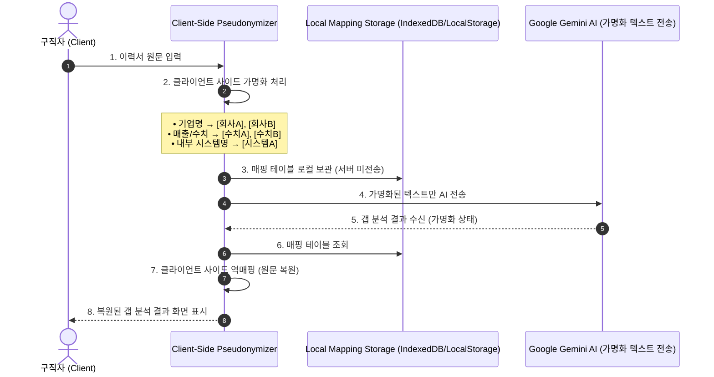

# 🛡️ CareerFit Data Privacy & Masking Policy Specification
**커리어핏 데이터 프라이버시 및 비식별화(마스킹) 정책 규격서**

---

## 1. 배경 및 목적 (Background & Purpose)

### 1.1. 배경 (Background)
구직자의 이력서, 경력기술서, 지원서 등 커리어 데이터는 개인의 성명, 연락처, 세부 경력, 전 직장 정보 등 극도로 민감한 정보(PII)를 포함하고 있습니다. 이러한 데이터가 외부 대형 언어 모델(LLM)로 전송될 때 발생할 수 있는 **개인정보 유출 리스크**와 **프라이버시 침해 불안을 근본적으로 해소**하고자 합니다.

### 1.2. 목적 (Purpose)
- **1차 식별 정보 필터링**: 직무 적합도(Fit) 및 역량 갭(Gap) 분석에 불필요한 고유 식별 정보(Direct/Indirect PII)를 전송 이전에 1차 필터링/마스킹합니다.
- **클라이언트 가명화 & 단계별 데이터 보호 격상**:
  - **[현재 단계 (포트폴리오 / MVP)]**: Gemini 무료 API 연동 환경에서 클라이언트 사이드 가명화(Pseudonymization) 및 PII 원천 마스킹 조치를 시행하여 민감정보 및 경영민감정보가 AI 프로바이더로 전달되지 않도록 실질적 보호 조치를 시행함 (비학습 효과 실질적 달성).
  - **[향후 상용화 단계 (Production Roadmap)]**: Enterprise Vertex AI + Zero Data Retention(ZDR) 계약을 체결하여 계약상 비학습 보장 및 데이터 0일 보관(ZDR)으로 명시적 보안 격상할 예정임.

---

## 2. 개인정보의 정의 및 비식별화 분류 체계 (Data Classification & Action Rules)

채용 공고(JD) 매칭과 역량 분석에 필수적인 **'직무 데이터(Job Data)'**와 분석에 불필요하거나 편향을 유발할 수 있는 **'식별 데이터(PII)'**를 엄격히 분리하여 처리합니다.

> ※ 참고: 이력서·경력기술서 내 소속 기업의 매출·실적 등 경영민감정보는 개인정보보호법상 PII에 해당하지 않으나, 유출 시 사용자의 전/현 소속 기업에 미치는 리스크를 별도로 고려하여 로컬 암호화 저장 대상에 포함함.

| 데이터 분류 | 포함 항목 (Data Fields) | 비식별화/처리 정책 (Action) | 비즈니스 및 기술적 근거 |
|:---|:---|:---|:---|
| **고유 식별 정보<br>(Direct PII)** | 이름, 전화번호, 이메일, 주소, 주민등록번호, 링크드인/SNS URL 등 | **원천 마스킹/삭제 (Drop or Regex Masking)**<br>• 홍길동 → `[USER_NAME]`<br>• 010-XXXX-XXXX → `[PHONE]`<br>• user@email.com → `[EMAIL]`<br>• 서울시 강남구... → `[ADDRESS]` | 역량 적합도 분석에 일절 불필요하며, 유출 시 치명적인 손실을 야기하는 직접 식별자. |
| **준식별 정보<br>(Indirect PII)** | 학력(출신교), 성별, 나이, 생년월일, 사진, 가족관계 등 | **사전 필터링/토큰 치환 (Drop/Generalize)**<br>• XX대학교 → `[UNIVERSITY]`<br>• 30세 / 1995년생 → `[AGE_REMOVED]`<br>• 남성/여성 → `[GENDER_REMOVED]` | 출신교, 나이, 성별 등 편향(Bias) 요소를 배제한 순수 역량 기반 매칭 및 블라인드 채용 기준 준수. |
| **경영민감정보<br>(Business-Sensitive Info)** | 소속(전/현) 기업의 비공개 매출·실적 수치, 내부 프로젝트명, 미공개 사업 성과, 고객사/파트너사명 등 | **클라이언트 사이드 가명화 (Pseudonymization)**<br>• 기업명 → `[회사A]`, `[회사B]`<br>• 매출/수치 → `[수치A]`, `[수치B]`<br>• 내부 시스템명 → `[시스템A]`<br>• 매핑 테이블은 로컬에만 보관(서버 미전송) 후 클라이언트 역매핑 복원 | 유출 시 전/현 소속 기업에 대한 기밀유지 의무 위반 리스크를 차단. 원문의 문맥과 의미는 유지하여 AI 역량 갭 분석을 정상 수행. |
| **직무/역량 분석 데이터<br>(Allowed Data)** | 담당 업무, 보유 기술(Tech Stack), 프로젝트 경험, 성과 지표, 사용 툴 등 | **전송 유지 (Extract & Pass)** | 채용 공고의 자격 요건/우대 사항과 1:1 매칭 점수 및 역량 갭(Gap)을 산출하기 위한 핵심 데이터. |

---

## 3. 데이터 처리 파이프라인 및 가명화 워크플로우 (Data Flow Lifecycle & Pseudonymization)

### 3.1. 단계별 AI 보안 및 비용 구현 로드맵
- **현재 단계 (포트폴리오 / MVP)**:
  - **Gemini 무료 API 유지 + 클라이언트 사이드 가명화 & PII 원천 마스킹 적용**
  - 커리어핏은 현재 클라이언트 사이드 가명화(Pseudonymization) 및 PII 원천 마스킹을 통해 민감정보가 AI 프로바이더에 전달되지 않도록 실질적 보호 조치를 시행하고 있습니다. (비용 0원, 비학습 보장 실질적 달성)
- **상용화 단계 (Production Roadmap)**:
  - **Enterprise Vertex AI + Zero Data Retention (ZDR) 계약**
  - 향후 상용화 단계에서는 Enterprise Vertex AI + Zero Data Retention(ZDR) 계약을 통해 계약상 비학습 보장으로 격상할 예정입니다.

### 3.2. 가명화(Pseudonymization) 처리 및 역매핑 메커니즘



#### 가명화 변환 및 복원 예시:
- **[이력서 원문]**:
  > *"A기업 ERP 고도화 프로젝트에서 연간 매출 120억 달성에 기여"*
- **[가명화 후 AI 전송]**:
  > *"[회사A] [시스템B] 고도화 프로젝트에서 연간 매출 [수치C] 달성에 기여"*
- **[매핑 테이블 - 오직 로컬에만 보관 (서버 미전송)]**:
  ```json
  {
    "회사A": "A기업",
    "시스템B": "ERP",
    "수치C": "120억"
  }
  ```
- **[갭 분석 결과 수신 및 로컬 역매핑]**:
  - Gemini AI로부터 `"[회사A] [시스템B] 프로젝트 성과가 우수함..."` 리포트 수신 시, 클라이언트 단에서 매핑 테이블로 역매핑하여 구직자 화면에는 `"A기업 ERP 프로젝트 성과가 우수함..."`으로 원문 복원하여 노출.

---

## 4. 데이터 처리 세부 파이프라인 (Data Pipeline Steps)

#### Step 1. 입력단 비식별화 & 가명화 (Client/Edge Regex Parsing & Pseudonymization)
- 사용자가 이력서를 업로드하거나 텍스트를 붙여넣는 즉시, 클라이언트 단에서 정규표현식(Regex)을 기반으로 이름, 연락처, 이메일 등 직접 식별 정보(PII)를 토큰화(`[USER_NAME]`, `[PHONE]`, `[EMAIL]`)하고, 기업명·실적 수치·내부 시스템명을 가명 토큰(`[회사A]`, `[수치A]`, `[시스템A]`)으로 변환합니다.

#### Step 2. 1회성 분석 요청 (LLM API Call)
- 가명화 처리된 순수 '직무/프로젝트 텍스트'만 프롬프트에 포함하여 LLM으로 전송합니다.
- 포트폴리오 단계에서는 Gemini 무료 API + 클라이언트 사이드 가명화 조치로 민감정보 유출 및 학습 위험을 실질적으로 차단합니다.

#### Step 3. 클라이언트 사이드 역매핑 (De-pseudonymization) & 원문 복원
- AI로부터 전달받은 갭 분석 리포트 수신 즉시 로컬에 보관된 매핑 테이블을 참조하여 클라이언트 화면에 원문으로 역매핑하여 표시합니다.

#### Step 4. 세션 종료 및 메모리 파기 (Immediate Memory Destruction)
- 분석을 위해 Supabase Edge Function을 경유한 임시 처리 텍스트(가명화된 텍스트 포함)는 갭 분석 결과 렌더링 완료 즉시 서버/세션 메모리에서 파기됩니다.
- 매핑 테이블은 사용자 로컬 암호화 보관소(`localStorage`)에만 유지되고 서버/세션 메모리에는 일절 남지 않습니다.
- ※ 사용자가 직접 등록한 이력서 원본은 브라우저 `localStorage`에 XOR+Base64 암호화 상태로 별도 보관되어 추후 공고 재활용 시 재사용됩니다. *(서버 전송 없음, 로컬 암호화 보관 지속)*

---

## 5. 로컬 데이터 보관 및 보안 메커니즘 (Local Data Storage Security)

- **서버 DB 미저장 (Pure LocalStorage)**: 커리어핏은 구직자의 개인 데이터를 중앙 서버 데이터베이스에 저장하지 않습니다.
- **XOR + Base64 클라이언트 암호화**: 사용자의 브라우저(`localStorage`)에 이력서 정보를 보관할 때 XOR 암호화 및 Base64 인코딩(`ENC_V1_...`)을 거쳐 보관되므로, 타 사이트나 물리적 스토리지 무단 접근 시에도 데이터 안전성을 제공합니다.

---

## 6. 법적 고지 및 데이터 책임 한계 (Disclaimer)

> [!IMPORTANT]
> **커리어핏 데이터 프라이버시 규정 고지**:
> - **[현재 단계 (포트폴리오 / MVP)]**: 커리어핏은 현재 클라이언트 사이드 가명화(Pseudonymization) 및 PII 원천 마스킹을 통해 민감정보가 AI 프로바이더에 전달되지 않도록 실질적 보호 조치를 시행하고 있습니다 (비학습 효과 실질적 달성).
> - **[향후 상용화 단계 (Production Roadmap)]**: 상용화 전환 시 Enterprise Vertex AI + Zero Data Retention(ZDR) 계약을 체결하여 계약상 비학습 보장 및 데이터 0일 보관(ZDR)을 명시적으로 구체화할 예정입니다.
